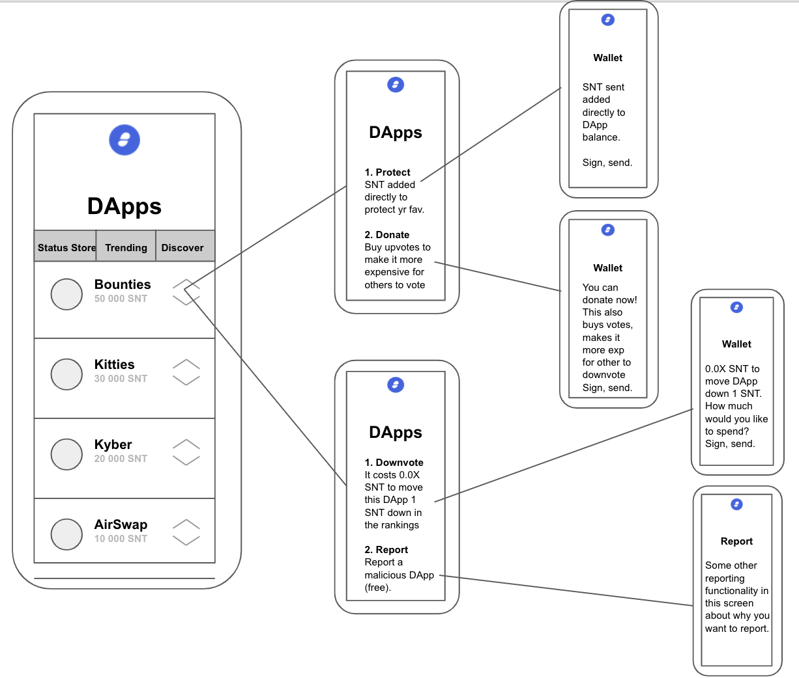

# How to Curate DApps Simply

## The Problem

We need a way (many ways, actually) of curating the list of DApps displayed in Status now that we're on mainnet. Currently, we curate these manually based on which ones actually work well on mobile, but this is not a long-term, nor scalable, solution.

## A Proposed Solution - Version 0.0.1

At first, we use a [simple game involving a bonded curve](https://github.com/andytudhope/Recollections): rank is based purely on which DApp has staked the most SNT, but the more SNT staked, the cheaper it is for the community to create "downvotes" which decrease the DApp's ranking.

This is an elegant game-theoretic solution with an **incredibly simple UI**.

### Features

1. DApps/developers **pay to rank**. This is no different than current SEO practices, except developers know _exactly_ the algorithm used and what is required to rank highly. Importantly, they are not paying a company: they are staking SNT in a registry. They do not need to trust Google, PageRank, FB etc. **AND** they stand the chance to earn ~60% of what they staked back if users vote on their ranking.
2. Users **pay to vote**, a fee which goes directly back to the DApp they are voting on. This means there is **no explicit incentive for users**, and it actually costs them to participate. Far from an error, this is key to the design of the whole system.

### Listen to Alice

I don't want to have to think about which links appear first in my searches. I certainly don't want to have to manage many different tokens with different governance rights and requirements just so that I can "trust" the content I'm looking at.

All I want is to know that the links which appear first are relevant to me, I want to be able to see easily how that "relevance" was calculated, and I want to be able to tweak things, but only when I feel really strongly about it. #DeleteFacebook.

Importantly, DApps that rank highly ought to be providing the most value to the community as a whole.

### Designing for Reality

Participation in any structure that requires votes and multiple stages, be it a DAO or a TCR, is _always_ low. This is not just because of poor interfaces and unstable technology, it is because getting people to track votes and tokens actively is almost always a bridge too far. So, let's design with that in mind.

There is no incentive for users to participate precisely because - even with "incentives" in other schemes - they have not been doing so. However, users still benefit as a side-effect of the system: the more SNT is locked up in the [DAppStore](https://github.com/andytudhope/Recollections/blob/master/DAppStore.sol), the less there is in circulation and the more valuable the SNT any given user is holding. 

In this way, even without assuming any user participation, we achieve the key design goal of the system-as-a-whole _without requiring any central authority whatsoever_: DApps which rank highly contribute - literally - the most value to the community.

### Some Scenarios

#### 1. I build a really bad/hurtful/illegal app and stake a lot of SNT to rank highly. What then? If I receive back the SNT it costs the community to downvote me (supposing they're even willing to do so), then I can just keep doing this endlessly.

**a.** Remember, due to the setup of the curve, you only receive back ~60% of what you staked. So, it'll cost you signficantly to keep that up over long periods of time.
**b.** Also, there is _contractual reality_ and the Status UI. The two do not need to be completely bound. If there is a DApp violating App or Play Store policies - for instance - we may _need_ to remove it from the UI. Anyone else is still more than welcome to implement another UI with different rules for the same contract.
**c.** There is another (free) option when downvoting for users to report DApps to Status that they think should not be in the UI.
    
#### 2. I am well-resourced actor who wants to ensure an upstart young DApp never ranks as highly as my own product. I'm just gonna downvote them out the registry.

**a.** Remember, again, that the cost to do this goes back to that developer. Though they only receive ~60% back, it's going to take some time to achieve your goals - time in which the community can organise.
**b.** It's also worth noting that any corporate bidding war, trolling, or other kind of underhanded tactic only ever has the net result of more SNT entering the DAppStore, which is _still_ benefitting the community as a whole.
**c.** Radical Markets can be tough environments - we just need make sure that inevitable competition ends up benefitting people, rather than putting them at an even greater disadvantage.
    
#### 3. I am a poor DApp developer who is really excited by the idea of permissionless participation. Now you're telling me I have to pay another fee? That's BS!

**a.** Yes, I know. This is what programs like Incubate and "Optimised for Status" (when we create that) are intended for. Remember that the "fee" you're paying doesn't go to Status, and that you can earn a lot of it back by building an engaged community that cares enough to vote on your product.
**b.** Also, free markets are the most efficient means we have ever discovered of optimising allocative efficiency. Though it can seem callous, this really is the best way I could think of to organise the system long-term.

### Show Me the UI

Obviously, this is very bare-bones. However, it does illustrate how simple we can make `Version 0.0.1`.

No tracking different tokens in your wallet and wondering when on-chain transactions are required. No reviews, or governance needs, or anything "extra" for you to do. Yet you can easily see why each DApp ranks where they do, and can influence that should you really want to.

Also note the tab with `Status Store`, `Trending`, and `Discover` at the top of the first screen. This simple game with staked SNT does not answer the "relevant to me" part of Alice's complaint very well, but there are other solutions to this: discovery and network topolgy-based solutions to find popular/relevant/trending topics, and various approaches being experimented with at StateOfTheDApps, OpenSea or Dappist etc. We could have separate tabs/filters for them as they are implemented and then allow users to curate their own searches by setting the filters to what they think - at a glance - is the most interesting to them.

### The Mechanism - Simply

1. A DApp stakes SNT  to rank.
2. Votes are minted based on how much is staked, using an exponential curve.
3. The `cost to vote = total cost / number votes available`. Less votes available = higher cost.
4. The `cost to vote`, paid by the user, is sent directly back to DApp when voting occurs (if ever).
5. The trick is here: `total cost == amountAvailable` of the SNT that DApp staked when the DApp's `effectiveBalance` (what it is ranked by in the UI) `== 0` as a DApp must earn back the amountAvailable from what they staked by the time they have been voted down to 0.
6. A DApp's `effectiveBalance = totalStaked - (number negative votes * (rate * (amountAvailable / number votes available)))`.
7. `amountAvailable = 62.5%` because I set the `amountAvailable = 1 / exponent` and then played with the numbers until they seemed optimal (there is [a bounty for this](https://github.com/andytudhope/Recollections/issues/2) too, though).

You can explore the [full spreadsheet here](https://docs.google.com/spreadsheets/d/1T_n6wR7XK0zj6yLdljfD0Vi1UADt3Uf7ZgdiUXVpUrE/edit?usp=sharing). Unfortunately, casting it as a graph doesn't help much: you need to play with it yourself and get a sense for how different values effect things. So, go on, put a few different values in for the exponent in `N2`, or for the negative and positive votes and see what happens.

If strings of numbers aren't your thing, [there is a bounty](https://github.com/andytudhope/Recollections/issues/2) to create more of a visual playground for the idea.

### Other Links
* [GitHub Repo](https://github.com/andytudhope/Recollections/)
* [Spreadsheet](https://docs.google.com/spreadsheets/d/1T_n6wR7XK0zj6yLdljfD0Vi1UADt3Uf7ZgdiUXVpUrE/edit?usp=sharing)
* [Tech Talk](https://www.youtube.com/watch?v=82wMcgHSej0&feature=youtu.be) (a little outdated now)