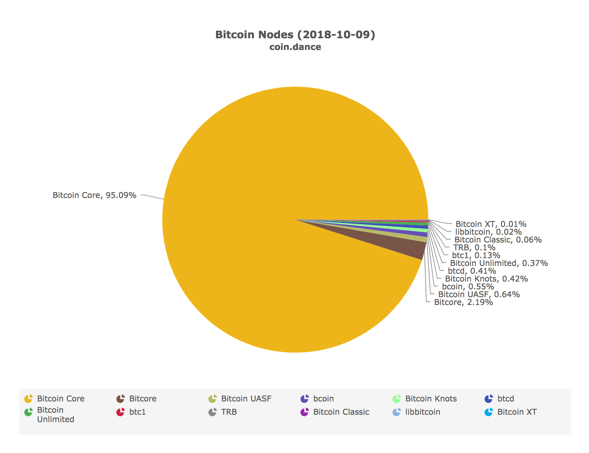
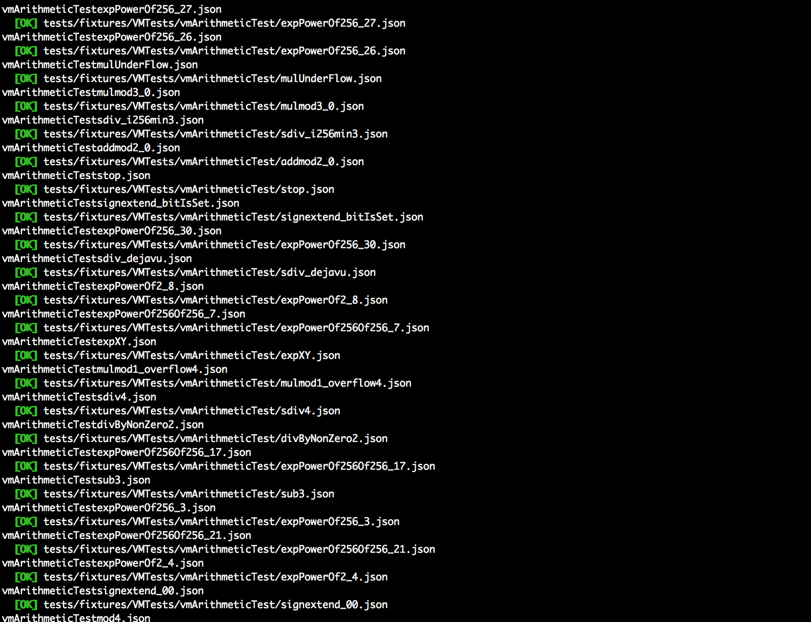

# Nimbus for Newbies

[Nimbus](https://nimbus.status.im) is a new client for Ethereum's next stage of development. It's a new [node](https://bitfalls.com/2017/11/26/whats-bitcoin-node-mining-vs-validation/), if you will. If you're an Ethereum protocol layperson and are trying to understand what Nimbus actually is right now, you've come to the right place.

We'll discuss sharding, scaling, and everything the [announcement post mentions](https://blog.status.im/introducing-nimbus-3360367bb311) in another post (or several) - the intention here is to get you familiar with Nimbus in a way that teaches you what Nimbus is _today_.

We want you to understand what this tool is, why it's here, how to use it and how to contribute to it so you, too, can help us build the new Ethereum.

## What is Nimbus right now?


For a broad overview of what it _wants to be_, see [the announcement](https://blog.status.im/introducing-nimbus-3360367bb311).

Right now - as of October 2018 - it's a set of tools which executes and passes a set of unit tests. In layman's terms, a unit test is computer code which needs to run without errors when executed. When executed through Nimbus, the results of this code's execution should not produce any errors. If all [these tests](https://ethereum-tests.readthedocs.io/en/latest/) _pass_, Nimbus can be considered an Ethereum client.

This is what a beautiful screen of passing tests looks like.


At this point, Nimbus will not do anything meaningful when you run it and it goes online and it cannot be used for connecting to your wallet or sending transactions. It will not synchronize the blockchain either in light or full mode, or launch any kind of UI.

## So What's The Point?


Right now, the team is developing a set of tools and libraries to satisfy the requirements of Ethereum 2.0: sharding support, scaling methods, etc. Given that Ethereum 2.0 must remain compatible with 1.0, the functionality for 2.0 will include everything 1.0 can do. This means that Nimbus will be an alternative to [Geth](https://bitfalls.com/2018/02/12/explaining-ethereum-tools-geth-mist/) and Parity as a full Ethereum node, but will also include features that can make it run as a _light node_ - a node that doesn't need to download the full blockchain - or even a [_stateless_](https://ethresear.ch/t/the-stateless-client-concept/172) node - a node that doesn't need to download state at all to be able to verify it.

Once the state of Nimbus is at feature parity with current clients, the team will move forward with the implementation of new features. Given that the tests we mentioned earlier are easier to pass with a client in full node mode, Nimbus will first be developed as a full node and then be upgraded with features required to make it run as a light node.

## Modularity

In order to fulfill its goal of running on low end and embedded devices, Nimbus will have to be extremely customizable. The ultimate goal is to have it support a plug and play module system in the form of APIs interacting with the Nimbus core.

Specifically, Nimbus will have different forms of builds. You'll be able to use its source code with certain flags (options) indicating what and how to build your copy of Nimbus - a copy you're putting onto a Nokia 3310 or into a smart oven won't be the same as a copy on a powerful desktop machine and that won't be the same as a copy you'll be installing into a microusb to plug into a hidden public USB outlet to covertly decentralize the network 🕵️‍♂️

And, yes, you'll be able to do all this.


Interfaces (like JSON-RPC, or one for embedded Java) will be developed for the different operating systems Nimbus is being installed on - we're focusing on open hardware, but we're not planning to leave any platform behind. Nimbus will provide an [EVM-C interface](https://github.com/ethereum/evmc), for example, so all clients that use it will be able to choose if they want to use Aleth, Geth or Nimbus.

Another modular part will be the back-end (SQLite or RocksDB), the logging (console, file, json, database) and the networking protocols i.e. being agnostic regarding specific Eth protocols and using plain http/s to bypass filtering (like public WiFi or censorship).

## Are you competing with Geth?

Yes and no. It's been a mission of Ethereum from day 0 to have multiple client implementations available at all times for the sake of network health and stability in case of bugs in one version. As an example, a bug in Bitcoin Core will hurt the entire Bitcoin blockchain because Bitcoin Core is used in [95% of the cases](https://coin.dance/nodes).



This is unacceptable in Ethereum, so we strive to diversify client implementations as much and as evenly as possible. Right now, Ethereum has Parity vs. Geth distributed [relatively evenly](https://www.ethernodes.org/network/1) with dust of other implementations sprinkled in between. The goal is to have some form of Nimbus take up at least a quarter of that pie.

Note that we're not looking to undermine Geth's or Parity's prevalence. We're looking to add new devices into the ecosystem and expand Ethereum's reach rather than _replace_ the current nodes. As an example, Status will be using Nimbus once it's ready.

## Building

Enough talk, let's build.

Before we begin, we'll assume that:

- you've read the [introduction to Nim](https://bitfalls.com/2018/10/09/introduction-into-the-nim-language/) and thus have Nim available
- you're on a command-line friendly system like OS X or Linux. If you're on Windows, we highly recommend spinning up a preconfigured virtual machine with Vagrant - something like [Homestead Improved](http://www.sitepoint.com/quick-tip-get-homestead-vagrant-vm-running/) should do. It's tweaked for web dev, but works equally well for everything else that doesn't have a UI.

### Installing

To run Nimbus, we'll need the RocksDB database and a newer version of Nim. On OS X, execute:

```bash
brew install rocksdb
curl https://nim-lang.org/choosenim/init.sh -sSf | sh
```

On Linux, this should do it:

```bash
sudo apt-get install librocksdb-dev rocksdb # or your own Linux distribution's equivalent
curl https://nim-lang.org/choosenim/init.sh -sSf | sh
```

Running nim --version should print something not unlike the following:

```bash
$ nim --version
Nim Compiler Version 0.19.0 [MacOSX: amd64]
Compiled at 2018-09-26
Copyright (c) 2006-2018 by Andreas Rumpf

git hash: f6c5c636bb1a1f4e1301ae0ba5a8afecef439132
active boot switches: -d:release
```

Next, we'll download Nimbus itself into the folder where we want our Nim projects to live.

```bash
git clone https://github.com/status-im/nimbus
cd nimbus
```

Nim comes with its own package manager, [Nimble](https://github.com/nim-lang/nimble). This means Nimbus' dependencies can be downloaded all at once with the command `nimble install`. You might get asked questions like `Prompt: eth_common@1.0.0 already exists. Overwrite? [y/N]` if you've used Nim before - answer yes.

_Note that Nimble installs all your projects' packages into a common folder, making them share their dependencies. This means your dependencies will not be visible in the project where you run `nimble install`. They will be in your home folder under `.nimble/pkgs`. We'll discuss why this happens and how to get around it and force per-project local dependencies in a future article._

After installing, the `nimbus` command will become available. Before we run it, let's check for available commands with `nimbus --help`. If this works, let's run Nimbus tests with `nimble test`. This will execute the Nimble task "test" which runs the unit tests we mentioned in an earlier section, making sure the Nimbus client is compatible with other clients our there.

```bash
nimble test
```

If everything goes well, the screen should scream green `[OK]`s.



You can run Nimbus by executing `nimbus`. It will look for some nodes online and maintain a connection with them. It will even try and start syncing with the blockchain but will get an error when it encounters a block it cannot process yet and fail - this is where we're at right now.

---

Congratulations - you're now running Nimbus, to an extent. In a future post we'll dissect some of the tests, look into contributing to Nimbus, dive into the Nim language and much more.
