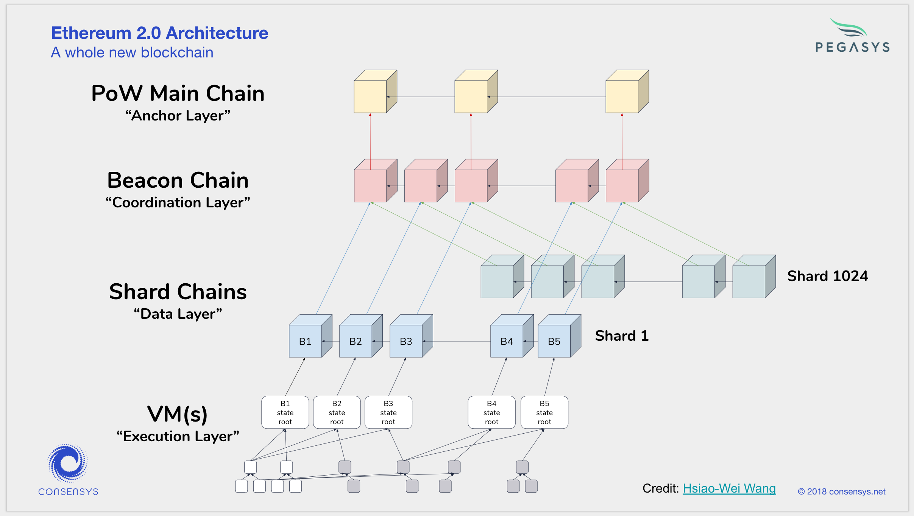
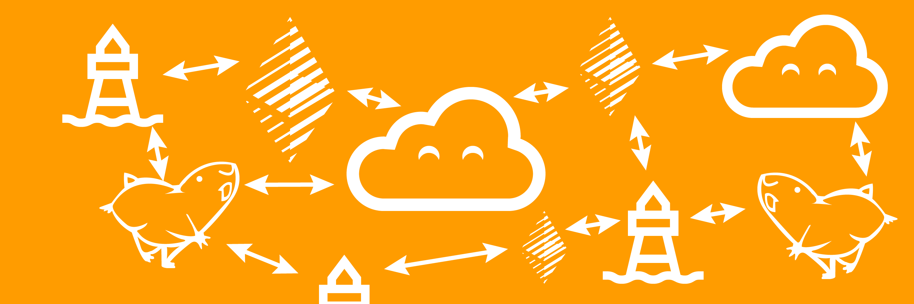

# Two Point Oh: Explaining Validators

We want you to understand that [Nimbus](https://our.status.im/nimbus-for-newbies/) is Ethereum 2.0 first. Our aim is to deliver a proof of concept by March 2019. This means that the team is focusing more on implementing the [new specification](https://github.com/ethereum/eth2.0-specs) than getting it to a viable Ethereum 1.0 state (this does not mean we're abandoning 1.0, just prioritizing 2.0). But there's the dreaded phrase - Ethereum 2.0. The scary upgrade everyone talks about but no one in the media seems to explore past the point of reposted press releases and speculative clickbait titles.

Two. Point. Oh.

Long words, mystical phrases, crazy promises and Power Ranger villain names are plentiful in Ethereum 2.0 - Beacon Chain, Slasher, Validator, Randao, BLS (Boneh–Lynn–Shacham) signatures, crystallization of state... I mean, just look at this.

How does one wrap one's head around this, especially with the recent merger of Casper and Sharding into "Shasper"?

This is the first in a series of Ethereum 2.0 posts from the perspective of the Nimbus team, breaking down each part of 2.0 into understandable chunks and documenting Nimbus' process of implementing that aspect, if applicable. 

Prerequisite knowledge? Almost none. Maybe [Ethereum basics](https://bitfalls.com/2017/09/19/what-ethereum-compare-to-bitcoin/) and the [difference between PoW and PoS](https://bitfalls.com/2018/04/24/whats-the-difference-between-proof-of-work-pow-proof-of-stake-pos-and-delegated-pos/).

## The Two Point Oh Overview

We'll start with the basics and explain the Validators in the new system, but first let's lay down some foundations on what the Eth 2.0 general plan is.

### Lesson 1: Serenity, not Shasper

At Devcon4 this year, Vitalik expressed his dislike of the term _Shasper_ (the name the community chose for the merging of Sharding and Casper) and asked the community to refer to the new Ethereum stage (so Ethereum 2.0 in general) as Serenity, the actual name of the next stage of development.

### Lesson 2: Multiple Phases

Serenity is coming in 4 distinct phases which will - when put together - take some two years of time.

<blockquote class="twitter-tweet" data-lang="en">
Great progress and roll out plan for <a href="https://twitter.com/hashtag/Ethereum?src=hash&amp;ref_src=twsrc%5Etfw">#Ethereum</a> 2.0 <a href="https://twitter.com/hashtag/devcon4?src=hash&amp;ref_src=twsrc%5Etfw">#devcon4</a> <a href="https://t.co/YwExJSu5AQ">pic.twitter.com/YwExJSu5AQ</a>
&mdash; Pelle Brændgaard (@PelleB) <a href="https://twitter.com/PelleB/status/1057581668976885760?ref_src=twsrc%5Etfw">October 31, 2018</a></blockquote>

- The first phase, called Phase Zero (we developers like to start counting from zero) or _the_ [_beacon chain_](https://our.status.im/two-point-oh-the-beacon-chain/) _phase_ will focus on getting the Proof of Stake beacon chain with validators up and running
- The 2nd phase will focus on adding shards as data, something we'll explain in a future post
- The 3rd phase will allow for transfer of this data across shards or within shards, i.e. smart contracts. Yes, this means that smart contracts will not be operational for a good while on the new Ethereum
- The 4th phase will, in Vitalik's own words, be tweaks and optimizations of this new world computer

### Lesson 3: Validators

A validator is an entity (person or company) who can propose new blocks for the blockchain, or someone who confirms another validator's proposal. Let's be clear here - this is automated software. There's no manual proposing of anything. Technically, you could, but you probably wouldn't be able to react in time. So for all intents and purposes, a validator is one "node", _one computer_ (let's call it **1C**) doing this proposing.

A validator who proposes is called a _proposer_, while a validator who validates the proposal is called an _attester_.

Here's where things branch out a little more.

Validators are picked from a big list of validators registered on something called the [beacon chain](https://our.status.im/two-point-oh-the-beacon-chain/). They are picked by a part of the blockchain in charge of selecting random numbers (a randomizer known as RANDAO+VDF) and those validators that are picked make a _committee_.

When some validators are picked to be the committee, they are responsible for _attesting to a state_, i.e. building the next block. This can happen in a timeframe we call a _slot_ (one slot means one proposal of a block and attestations from other validators that this block is A-OK), and a set of slots during which all the randomly picked validators have had the opportunity to make an attestation is called a _cycle_.

Wow, much terms, very glossary, huh?

Don't worry, that's it for definitions. There is one more thing you need to know about the validators - how to be one!

### Becoming a Validator

In order to become a Validator, you need to deposit *exactly* 32 ether into a smart contract on the proof-of-work main Ethereum blockchain (the one we have now). This generates something like a "validator membership card" which lets you participate in the new system. Validators will be responsible for a specific shard or two (to be added later), and one validator will be able to propose/attest for one to two shards. In other words, 1C of resources lets you validate on up to two shards. If you want to stake more ETH, you have to power up to another 1C of resources. Staking pools thus become something of an impracticality, enhancing the network's decentralization.

You see, the goal is to have the two systems (PoW vs PoS) live side by side for a good while because - as we explained in the phases section above - the first two phases won't have any data transfer in the system at all, so we'll still be relying on the PoW chain to process our data transactions. The transition will be gradual and no, miners won't suddenly be out of a job or stuck with outdated hardware. In fact, things are looking up for them - that's something we'll discuss in the ProgPoW post a little later.

So, how long can I be a validator? And what was that all about with the slashing with Slasher and losing stake? And what are the validators validating if we don't have transactions right off the bat?

Slow down there, knowledge-thirsty reader! Let's tackle these one by one.

1. A validator can remain in the system indefinitely, provided he doesn't misbehave.
2. A validator will lose part of his stake (the 32 ether) periodically over time. This loss will increase dramatically as time goes by which means shorter offline periods will be forgiven much faster than longer ones. The validator will not lose ALL of their stake - instead, the validator will keep losing until a certain threshold is reached (i.e. 28 ether) and then be kicked off the validators team. Several months will need to elapse before the validator can withdraw the remaining ether. The validator can also lose stake for misbehaving - claiming that a transaction is valid when it isn't. This punishment will be more severe, but it's not yet clear how severe. The loss of stake is called slashing (a part of your stake is slashed) and the algorithm doing this is called Slasher.
3. The new blockchain will basically be empty or junk-filled blocks at first. Since there's no data and no shards to reference, the blocks on the beacon chain will not contain anything particularly useful.

## Nimbus' implementation

Validators are a big part of the [Beacon Chain](https://our.status.im/two-point-oh-the-beacon-chain/), and our team is working hard on delivering a proof of concept Beacon client by March 2019. What we'll be delivering first is a client which can run a beacon chain in cooperation with other teams' clients or other Nimbus instances. 

Stay tuned for further updates, we'll update this space as we make progress.

## Conclusion

A validator is the modern "miner", but one who does not waste electricity to confirm transactions - instead, a validator builds blockchain blocks from transactions if selected by the system and other validators attest his actions. These groups of validators together form the new chain, and no one validator is more powerful than the next. To become a validator, a user must send 32 ether to a smart contract on the current proof-of-work blockchain which generates a receipt or a "validator membership card" on the [beacon chain](https://our.status.im/two-point-oh-the-beacon-chain/).

Continue reading the Two Point Oh series by following the [Nimbus blog](https://our.status.im/tag/nimbus/), or the [Two Point Oh tag](https://our.status.im/tag/two-point-oh/).
