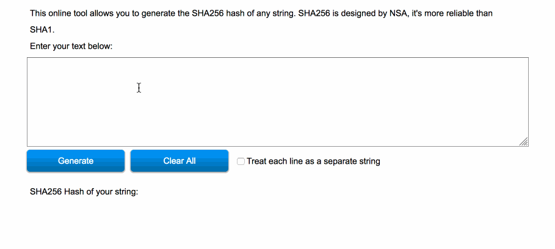

This post is part of the [Two Point Oh](https://our.status.im/tag/two-point-oh/) collection explaining Ethereum 2.0, now known as Serenity. In this part, we'll explain the Beacon Chain.

Prerequisite knowledge? Just [this short post about Validators](https://our.status.im/two-point-oh-explaining-validators/). By now you also probably know that our ultimate goal is for Ethereum to use proof-of-stake for achieving consensus. If you're not familiar with PoS, I highly recommend you [read this explainer first](https://bitfalls.com/2018/04/24/whats-the-difference-between-proof-of-work-pow-proof-of-stake-pos-and-delegated-pos/) to learn the difference between the current Proof of Work system and Proof of Stake.

Now grab a cup, pull up a chair and throw your feet in the air. Let's dive in.

### The Beacon Chain

**The beacon chain is a new blockchain** at the heart of the new Ethereum.

One responsibility of this chain is to allow [Validators](https://our.status.im/two-point-oh-explaining-validators/) to enter the staking system and build the blockchain instead of the miners. The other is to store references to shard state.

#### Responsibility 1: Staking Gateway

At first, this will be done via a _registration contract_ deployed on the regular, current Ethereum blockchain because the intention is to have the two of them live side by side for the foreseeable future (think two-ish years).

This smart contract will let you send 32 ether into it, and will generate a receipt (an event readable by blockchain clients) indicating a "membership card", showing the committer (i.e. the *staker*) as a qualified Validator. It's important to note that because this is _one way_, there is no way to exit this system back onto the current PoW chain. Once you commit 32 Ether into staking, you can only withdraw them to a specific shard (when those are added), but not back into EVM land. And if your spidey-sense is tingling thinking that this sounds like there'll be two Ethers in existence in parallel - you're right. More on that in the next post (_Two Point Oh: The Tale of Two Ethers_).

Note that after a full transition to a PoS system and once the PoW chain has been retired into a legacy shard or a master archive contract (more on this in _Two Point Oh: The Legacy Shard_), all of this will be happening only on the Beacon Chain and its connected shards and will feel much more natural and streamlined.

Once registered this way on the beacon chain, a Validator can be randomly picked to validate on one or two shards (see the Validators post for further clarification on that part). The Validator will be combining the data from its designated shard(s) with the Beacon Chain data, and proposing a new block or confirming/rejecting some other Validator's proposed block until they've had their turn in the *Cycle*.

To reiterate, the Beacon Chain does not have _data_ - it will not store the balances of accounts, locations of tokens, state of dapps, or any other information the current blockchain stores. Firstly, it stores the list of Validators. Secondly, it stores _attestations_.

#### Responsibility 2: Storing Attestations

The what now...?

**Attestations** are confirmed and validator-signed hashes that reference the current state of a given shard. This sounds super computer-sciencey, so let me clarify further.

When you _hash_ something, you turn it into a series of letters and numbers that is completely different every time even a single character in the original _something_ changes. For example, if you open [this generator](https://passwordsgenerator.net/sha256-hash-generator/), and write `Hell`, the hash produced under the field will be __completely__ different from the one produced when you just add `o` and make it `Hello`. 

If you change even a single pixel in an image that's full-HD in resolution and hash it, that hash will also be completely different from the original one. This means that even the smallest change will produce dramatically different hashes, making changes very easy to detect.

Without going into shards too much, it's reasonably accurate to consider them data on which we execute certain operations (like moving balances of tokens around, or shifting [non fungible token](https://bitfalls.com/nft) ownership). Shards are the blockchain's "hard drive". Every once in a while when a shard's total data changes (i.e. even if just one of 1 million accounts changes balance), a new hash is generated from this new state which is then checkpointed (attested) on the beacon chain. In other words, whenever a shard's data changes, that change is reported to the beacon chain by validators as having happened. This lets shards track each other's changes through the beacon chain, enabling async (non-real-time) communication between them. Why this is important and what other problems this brings up will be explained in the _Two Point Oh: Sharding_ post.

This is where the _beacon_ in _beacon chain_ comes from. Like a lighthouse in a foggy port, the beacon is there to help everyone find each other - all shards communicate through it, all nodes talk through it and collaborate on building the chain.

### Beacon Nodes and Validator Clients

By now you may be wondering how [mining and validations nodes](https://bitfalls.com/2017/11/26/whats-bitcoin-node-mining-vs-validation/) fit into all this and whether their terminology changes as well. The answer is: yes 😱

There are two main types of "nodes" you need to be aware of now, each with its set of subtypes which we will not cover here.

**Beacon nodes** are in charge of _validating validators_, aggregating signatures (i.e. many validators submit many keys and processing them individually would take ages, so we're looking into processing many of them at once), grabbing the necessary data with which to build new blocks and passing it on for validation to Validators. Beacon nodes are equivalent to miners in the current system in that they're heavier on the resources and will need to be run on non-trivial hardware.

**Validator Clients** on the other hand can (in theory) be extremely lightweight bits of software like what we're building at Nimbus. They're programs the only function of which is to remain connected to the internet and to keep staking your Ether in the system (a persistent connection is required because a validator needs to sign their attestation and send it back to the network when requested). The Validator clients build the blocks from the data provided by the beacon nodes and send them back to the network. The Validator clients also suffer the consequences if they misbehave or go offline - it is there that the _slashing_ (i.e. reduction of stake) happens. While you may be expecting to validate from something like a smartphone, that's probably not going to happen - the battery would die instantly due to the needed bandwidth (constant communication with the network) and too frequent read/write operations on the phone's hard drive.

There are other types of nodes as well - light clients, ultra light clients, stateless nodes, full archive nodes that help with retrieval of data the rent of which expires (more on that in *Two Point Oh: Paying Data Rent*), partial archive nodes, and more - we'll go through all those eventually.

## Nimbus' implementation

Right now the Nimbus team is working on several components of the Beacon Chain [specification](https://github.com/ethereum/eth2.0-specs/blob/master/specs/beacon-chain.md).

Our main body of work regarding the beacon chain itself is in a standalone repository we dubbed [nim-beacon-chain](https://github.com/status-im/nim-beacon-chain). It's separate from Nimbus itself because the aim is to develop it as a component to be plugged into Nimbus' build cycle as needed. In other words, when running Nimbus as super-light node, you won't need to use the beacon chain module - that can hardly run on an old smartphone anyway. That said, this repo will be integrated into Nimbus some time in December to make sure it works on both fronts.

While we are aiming for a proof of concept release in March 2019 which should be able to do "beaconing" - connecting to other clients, validating, shuffling validators, building blocks - the biggest blockers we currently foresee are undefined areas of the specification. All of the client implementer teams sorely want cooperation and smooth communication between clients, but without specced out communication methods it'll be hard to agree, so this needs more work. Likewise, the commit/reveal scheme of the RANDAO randomizer (see _Two Point Oh: Randomness_) is still in the air in regards to its definition in the spec, so it's not too clear on how this should be implemented by the clients. Last but not least, the fork choice rule - the method by which a client picks which fork to follow in a chain with diverging blocks - is also largely undefined and under discussion.

We're all basically doing this right now.

<iframe src="https://giphy.com/embed/WkXTjAYa7b34A" width="403" height="480" frameBorder="0" class="giphy-embed" allowFullScreen></iframe>

## Conclusion

There's been a lot of content to absorb throughout the past two posts: Validators and the Beacon Chain make the core of Ethereum 2.0 and it's vital that you absorb this content adequately and with understanding. 

Going forward, the posts will be arguably shorter, simpler and more specific but the general aspects of the new system as presented so far are unlikely to change and will make a good basis for explaining things to others. Make sure you read this as many times as necessary for a full understanding and don't hesitate to [bombard me with questions](https://twitter.com/bitfalls).

The TL;DR recap is: the Beacon Chain is Ethereum 2.0's new core chain, to which all the _shards_ connect and talk through. The Beacon Chain is the means of entering the staking system and earning passive income (See _Two Point Oh: Economy_) on your staked ether, but also the means by which we achieve communication between shards as they store their final state's hash in the Beacon Chain's blocks. Beacon nodes are builders of the blockchain as they process copious amounts of data and send it for validation to Validators, while Validators build the blocks and send them back, staking their ether for a chance to tell their truth and have it confirmed by other Validators.

Next up, we'll briefly discuss the _Tale of Two Ethers_ (and no, I don't mean Ethereum Classic).