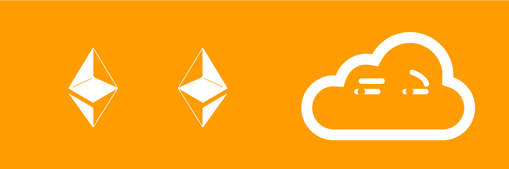

# Two Point Oh: The Tale of Two Ethers

This post is part of the [Two Point Oh](https://our.status.im/tag/two-point-oh/) collection explaining concepts in Ethereum 2.0, now known as Serenity. In this part, we'll talk about two parallel versions of ether and what that means.

We recommend you read the [Introduction to Validators](https://our.status.im/two-point-oh-explaining-validators/) and [Introduction to Beacon Chain](https://our.status.im/two-point-oh-the-beacon-chain/) first in order to hit the ground running.

"So what's all this about two ethers? Do you mean 2 eth, Bruno?"

No, inquisitive reader! I mean literally two *kinds* of ether. Like a real ether and a [bizarro](https://en.wikipedia.org/wiki/Bizarro) ether. Two _different native tokens/currencies_ of the Ethereum network. 😱

## It's the Registration Contract's Fault!

Remember how [we said](https://our.status.im/two-point-oh-explaining-validators/) that in order to become a Validator you'd have to commit a [stake](https://bitfalls.com/2018/04/24/whats-the-difference-between-proof-of-work-pow-proof-of-stake-pos-and-delegated-pos/) of exactly 32 ether into a registration contract on the current proof-of-work chain, which would then generate a receipt recognizable by the beacon chain?

That receipt serves as your permission slip to be a validator, but where does the 32 eth go?

The 32 eth is what we call _burned_ - forever locked in an address it cannot be retrieved from. In fact, if you send ether to a null address (`0x0`), you accomplish the same thing - the ether is stuck in an address no one can ever generate a key for, and effectively ceases to exist except behind this impenetrable glass case for everyone to see but no one to touch.

So the registration contract locks up our eth, okay.  What does that have to do with two ethers? And how is _burned_ ether a _stake_, if it's _burned at the stake_? (I'm sorry, I'm about to become a dad, so dad jokes and puns are becoming normal to me)

When you lock up your eth for staking this way, there is technically no way to get it back out. However... The registration contract will accept more than just the ether needed for staking. What actually happens is you call (through a client like [Nimbus](https://our.status.im/nimbus-for-newbies/)) a so called _payable_ function: a function that can accept ether. Along with 32 ether, you also pass in some additional data, among which is the ID of the shard to which you will be withdrawing your ether on exit from the validators pool. So if you stop being a validator, your stake is withdrawn to a specific shard onto a specific ethereum address (more on sharding in _Two Point Oh: Sharding_).

We mentioned previously that shards would come later - after the beacon chain is up and running - and that even then shards wouldn't have state transitions at first (no smart contracts).  So the beacon chain ether won't be useful even when you'll be able to withdraw it to some shards until late in the game. Therefore, the PoS ether "created" by receipts of PoW ether deposits on the registration contract is also ether, but markedly different from the PoW ether in that:

- it won't have any utility for a long time
- it cannot be turned back into PoW because there is no deregistration contract, only validator-exit functionality which can only withdraw ether to a sharded address

## But... but... markets!

If there are two ethers, one mock ether on the PoS chain that won't have a use case beside staking and earning dividends for a while, and one "real" ether that's the one we've been using so far on the PoW chain, won't that split the market, influence total supply numbers and inflation percentages, and wreak havoc in trading circles causing people to do arbitrage between the two types?

The answer is: probably not, but it depends on how the various websites and exchanges will visualize this.

The case against market chaos is that websites like CMC and similar price aggregators still have access to the public side of the blockchain, including its total supply and inflation amount values. Therefore, CMC and similar websites can make an edge case in which they sum the numbers of the two Ethereums and show information that way. What about separate prices for the two ethers (arbitrage)?

The case against arbitrage is the fact that you cannot take PoS ether back into PoW ether, and you cannot trade PoS ether (initially). This one-way street makes arbitrage impossible. You'll only be able to keep trading in PoW ether. Once PoS ether can be moved around, we'll have two active tokens which can be moved independently, yes, but once PoS ether can be moved around as well, it won't be long until one of two possible things occurs:

1. Either state transitions are imminent and a deregistration contract will become an option, making it possible to move PoS ether to PoW ether, equalizing price or
2. The PoW chain will be turned into a legacy shard or an archive contract (more on that in _Two Point Oh: The Legacy Shard_) and PoW ether will be phased out with an auto-conversion into PoS ether on matching addresses (backwards compatible).

That said, yes, it is not impossible that for a short while we'll have two different incompatible ether types active at the same time. How this is going to be resolved remains to be seen. Rest assured, however, that they'll both walk off into the sunset amicably.

## Conclusion

So, TL;DR. During the transition phase while the PoW Ethereum still exists and PoS Ethereum is being developed, there will be two different ether tokens. One will be used as gas and block reward on the proof of work chain, the other will be used as stake (and reward) on the PoS chain. The former can become the latter, but not vice versa. It will only make sense to move your PoW ether to PoS ether if you want to be a beacon chain early adopter and take advantage of higher staking rewards in the early period while things are still being worked on. It will not be useful for anything else for a good while, so it's advisable to keep your PoW ether if you actually use it for smart contracts, dapps, or trades.

Questions? Comments? I'm [on Twitter](https://twitter.com/bitfalls).